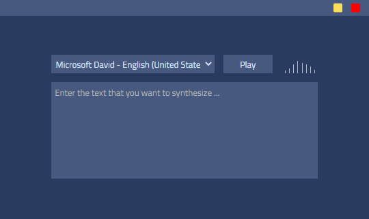

    <h3 align="center" style="margin-bottom: -10px;">Echo</h3>
    
Echo desktop app.

    

## **Download**

Currently, only Windows is supported.

## **Changes**

_v1.0_

- add multiple themes capability
- embed tweets
- add tweet photo viewer
- handle outside click for header actions
- handle error case for apis
- fix application development issue
-

## **License**

This product is licensed under the [GPL-3.0](./LICENSE.md) license.

---

    Made with :heart: by <a href="https://github.com/afractal">@afractal</a>

